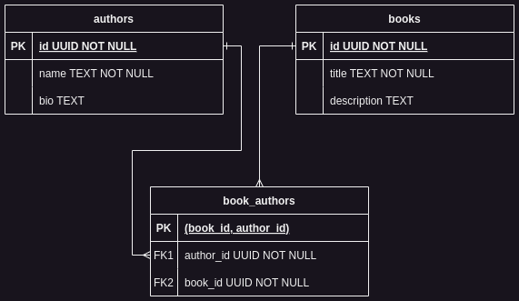

# Welcome to Open Library Dump to PostgreSQL Project
This Project is dedicated to discovering the different shapes of JSON for each record in the authors dump and works dump of [Open Library](https://openlibrary.org/developers/dumps) and then writing data that is needed for my [Universal Library website](https://github.com/MohammedAHelmi/universal-library) to a [PostgreSQL](https://www.postgresql.org/) database.
## About The dumps
The dumps are text files where each line represents a record i.e. a work / an author and its metadata. The data about the work / author is in the JSON part of the line but the JSON schema is unified records. 

## First challenge: Open files and Extract JSON
The files are massive in size 0.5G and 2.9G. All text editors I used struggled to open the first one and none could open the later completely.

when working with this kind of files in Node.js, streams are the perfect tool for the job. So I built pipelines to help me discover the JSON schema that encompasses all records. Then I decided the right relations, table columns and their types based on that global schema. Finally, I wrote data concurrently to the database. The first stream in the pipeline was always the read stream created by [`createReadStream()`](https://nodejs.org/api/fs.html#filehandlecreatereadstreamoptions) which reads a file in chunks.

The second stream in the pipeline was the `JSONExtractorStream` whose implementation can be found in `base-streams` directory. It's a [template class](https://refactoring.guru/design-patterns/template-method) that extracts the JSON part, parses it and leaves the function that extracts the needed data to push to the next stream for children to implement hence `AuthorExtractorStream` and `BookExtractorStream` classes are implemented in `authors` and `books` directory accordingly. 

`JSONExtractorStream` inherits from `Duplex` stream class rather than `Transform` mainly because I may had to push data more than one time and pause when a pushback happens then resume pushing when the destination stream calls `_read()` again all before I receive a new chunk from source stream so I needed to implement `_write()` and `_read()` rather than `_transform()`. 

`JSONExtractorStream` receive a chunk in `_write()` then extracts the JSON from each line of the chunk and preivous chunk tail using a [regular expression](https://developer.mozilla.org/en-US/docs/Web/JavaScript/Guide/Regular_expressions) then parses each JSON to a JS object and stores all of them to push them to the next streams using `_read()` as mentioned in the last paragraph.

## Second challenge: Find one schema that encompasses all different JSON schemas
First I implemented `giveSchema()` to find a schema for any JS variable i.e. the type of the variable. If the type is a list, then I have to find the schema of the contents and store it in `items` property of the schema. If the type is an object, then I need to recursively find the schema of each property and store it in `properties` property.

I also needed to implement `mergeSchemas()` to merge the schemas of 2 variables i.e. merge the type property of their schema for example if the `type` property of one schema is `string` and the other is `['number', 'Arrary']` then the new merged `type` is `['string', 'number', 'Array']`. The `items` and `properties` properties are mergered as well.  

I used the 2 functions to build the `SchemaDiscoverer` stream which is a `Transform` stream that receives a JS object, finds its schema and merges it with the schema it already has, and this becomes the new schema that is holds. Finally it pushes the schema of all of the objects at the end of the stream.

Finally, I built the pipelines to discover the schema of authors dump and works dump and write them into files to I can review them to know what are the shapes of the data that I need to add to the database the code for that is in `explorings/discover-schemas.js` file.

## Third challenge: Write to Database
I implemented a [template class](https://refactoring.guru/design-patterns/template-method) `DBWriter` which you can find `base-streams` directory. 

To ensure that the pace of the streams do not overwhelm the pool of database writers the class has 2 method `_getAllocation()` which return a promise that resolves when there is an available writer and `_releaseAllocation()` resolves any promise that's waiting for a writer to be free. Both functions must be used inside `_read()` before and after using the database writers pool. The idea is similar to a [semaphore](https://en.wikipedia.org/wiki/Semaphore_(programming)).

Calling `cb()` in `_read()` must be any where after `getAllocation()`. That mechanism ensures that backpressure is applied when all the writers are busy.

Finally I have function that populates each table using a pipeline with the correct parameters. The pipelines' structure is the same so the pipeline initialization is refactored in a [builder class](https://refactoring.guru/design-patterns/builder). 

I have other miscellaneous functions that I use to make materialized views for the `count` of records in `authors` and `books` tables, the `id` and `row_number` according to the order of the `title` of the books or the `name` of the authors, indexs on `row_number` for efficient access, and lastly  [GiST indexes](https://www.postgresql.org/docs/8.1/gist.html) on the [Trigrams](https://www.postgresql.org/docs/current/pgtrgm.html#PGTRGM-CONCEPTS) of books `title` and authors `name` to enable efficient search.

## ERD

## How To Run?
1. Make sure That you have PostgreSQL
2. Download [authors dump and works dump]((https://openlibrary.org/developers/dumps)) and add them in `data` directory
3. Run `npm run discover` to output the files with schemas of the dump however I already ran it and included the result in `explorings` directory
4. create an empty database
5. create a .env file and make sure to provide the following parameters correctly
    - DB_HOST
    - DB_PORT
    - DB_USER
    - DB_NAME
    - DB_PASSWORD
    - DATABASE_URL
    - MAX_DB_CONNECTIONS
6. Open terminal and run `npm install`
7. run `npm run migrate up` to create tables
8. run `npm start` to begin writting to the database